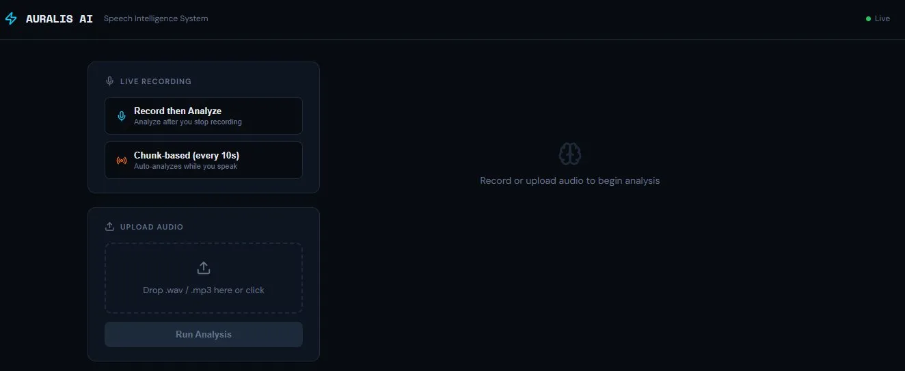
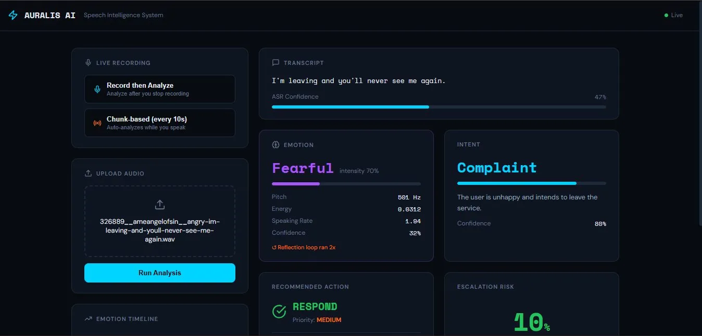
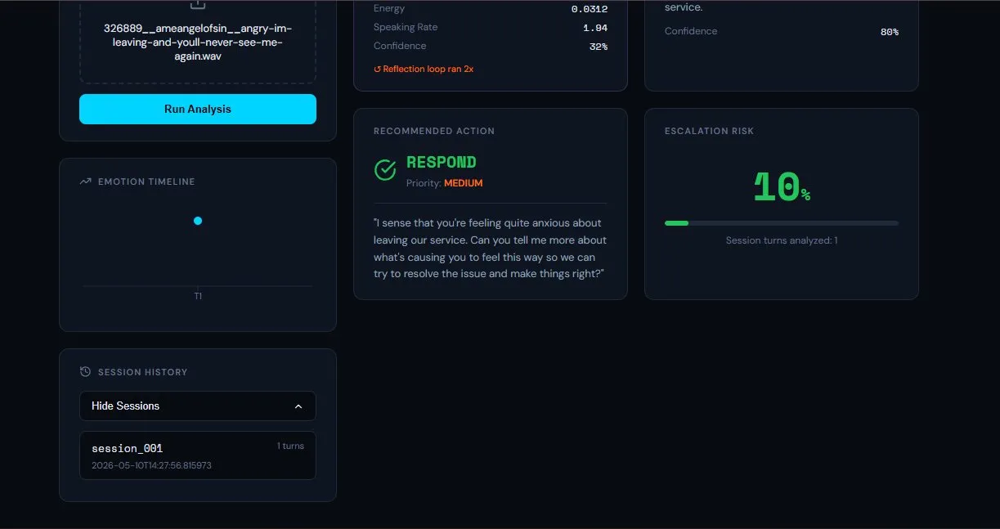

# Auralis AI

**Multi-agent speech intelligence system for emotion-aware conversational analysis**


**🔗 Live Demo:** [auralis-ai-seven.vercel.app](https://auralis-ai-seven.vercel.app) &nbsp;|&nbsp; **API:** [auralis-ai-gf7f.onrender.com](https://auralis-ai-gf7f.onrender.com)

---

## Overview

Auralis AI is a fully deployed, multi-agent GenAI system that processes speech in real time. It transcribes audio, detects emotion and intent in parallel, tracks conversation history across sessions, calculates escalation risk, and generates empathetic responses — all orchestrated through a LangGraph stateful pipeline.

---

## Screenshots

### Dashboard — Idle State



### Analysis Result — Emotion, Intent, Escalation Risk



### Session History and Emotion Timeline



---

## Architecture

```
Audio Input
     │
     ▼
Supervisor ──► ASR Agent (Groq Whisper)
     │
     ▼
Parallel Dispatch
     ├──► Emotion Agent (librosa + Random Forest)
     └──► Intent Agent  (Groq LLaMA 3.1)
               │
          Fan-In Node
     (reflection loop: retry emotion if confidence < 0.6, max 2x)
               │
          Memory Agent (Supabase Postgres, escalation risk)
               │
          Supervisor (routing)
               │
     ┌─────────┼─────────┐
  CLARIFY   RESPOND   ESCALATE
               │
          Action Agent (Groq LLaMA 3.1, empathetic response)
```

**Deployment:**

```
Vercel (React frontend) → Render (FastAPI + Docker) → Groq API
                                                    → Supabase Postgres
```

Total infrastructure cost: **$0**

---

## Agents

| Agent      | File                  | Description                                                                           |
| ---------- | --------------------- | ------------------------------------------------------------------------------------- |
| ASR        | `asr_agent.py`        | Groq Whisper transcription, confidence from `avg_logprob`                             |
| Emotion    | `emotion_agent.py`    | librosa features + RAVDESS-trained Random Forest (61.5% acc)                          |
| Intent     | `intent_agent.py`     | Groq LLaMA — classifies complaint / inquiry / feedback / request / escalation_request |
| Memory     | `memory_agent.py`     | Supabase Postgres, trend-based escalation risk across last 3 turns                    |
| Supervisor | `supervisor_agent.py` | Pure routing logic, no LLM, conditional edges                                         |
| Action     | `action_agent.py`     | Groq LLaMA — clarify / respond / escalate paths                                       |

**Supervisor routing thresholds:**

- ASR confidence < 0.3 → clarify
- Escalation risk > 0.75, intent = `escalation_request`, or anger intensity > 0.80 → escalate
- Complaint or frustration → respond (medium priority)
- Everything else → respond (low priority)

---

## Tech Stack

| Layer             | Technology                                              |
| ----------------- | ------------------------------------------------------- |
| Orchestration     | LangGraph, LangChain                                    |
| LLM + ASR         | Groq API — LLaMA 3.1 8b instant, Whisper large-v3-turbo |
| Emotion Detection | librosa + scikit-learn Random Forest (RAVDESS)          |
| Backend           | FastAPI, Uvicorn, Docker                                |
| Database          | Supabase Postgres via SQLAlchemy                        |
| Frontend          | React, Vite, Recharts                                   |
| Deployment        | Render (backend), Vercel (frontend)                     |

---

## API Reference

| Endpoint                | Method | Description                                                    |
| ----------------------- | ------ | -------------------------------------------------------------- |
| `/analyze`              | POST   | Accepts audio file + optional `session_id`, runs full pipeline |
| `/health`               | GET    | Health check                                                   |
| `/sessions`             | GET    | Lists all sessions with turn counts and last active time       |
| `/history/{session_id}` | GET    | Full conversation turn history for a session                   |

**`POST /analyze` response:**

```json
{
  "session_id": "string",
  "transcript": "string",
  "asr_confidence": 0.47,
  "emotion": { "emotion": "fearful", "confidence": 0.32, "intensity": 0.7 },
  "intent": { "intent": "complaint", "confidence": 0.8, "summary": "..." },
  "escalation_risk": 0.1,
  "emotion_retry_count": 2,
  "priority": "medium",
  "action": "respond",
  "response": "string"
}
```

---

## Getting Started (Local)

**Prerequisites:** Python 3.11+, Node.js 18+, ffmpeg, Groq API key, Supabase project

```bash
# 1. Clone
git clone https://github.com/shrutii-26/Auralis-AI.git
cd Auralis-AI

# 2. Set up .env
GROQ_API_KEY=your_groq_api_key
WHISPER_MODEL=whisper-large-v3-turbo
INTENT_MODEL=llama-3.1-8b-instant
RESPONSE_MODEL=llama-3.1-8b-instant
DATABASE_URL=postgresql://...

# 3. Backend
pip install -r requirements.txt
uvicorn main:app --host 0.0.0.0 --port 8000 --reload

# 4. Frontend
cd frontend
npm install
npm run dev
```

---

## Key Design Decisions

**Random Forest over deep learning** — RAVDESS has only 1440 samples, too small for deep learning without overfitting. RF is explainable and fast at inference.

**Groq over Ollama** — Free API tier, no local GPU required, enables cloud deployment.

**LangGraph over manual orchestration** — Built-in state management, conditional edges, and parallel execution. The reflection loop and fan-out/fan-in would require significant boilerplate otherwise.

**Supabase over SQLite** — SQLite doesn't work on platforms with ephemeral filesystems. Supabase Postgres free tier is persistent and cloud-native.

**Parallel fan-out for emotion + intent** — Both are independent; running simultaneously reduces pipeline latency.

---

## File Structure

```
auralis-ai/
├── main.py               # FastAPI endpoints
├── graph.py              # LangGraph pipeline
├── state.py              # AgentState schema
├── emotion_model.pkl     # Trained Random Forest
├── train_emotion_model.py
├── requirements.txt
├── Dockerfile
├── agents/
│   ├── asr_agent.py
│   ├── emotion_agent.py
│   ├── intent_agent.py
│   ├── memory_agent.py
│   ├── supervisor_agent.py
│   └── action_agent.py
└── frontend/
    └── src/
        ├── App.jsx
        ├── main.jsx
        └── index.css
```

---

## License

MIT
